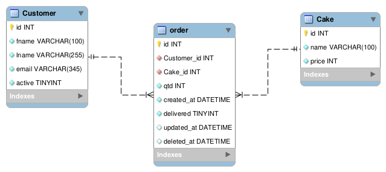

# API Rest com GO

## Objetivo geral
Criar uma API rest completa utilizando a linguagem GO

## Desafio
API onde uma vovó possa guardar dados de clientes de sua confeitaria de bolos.

## Tecnologias propostas
Utilizar o pacote [gorila/mux](https://github.com/gorilla/mux)

## Especificações
A aplicação é dividia em 3 entidades, sendo elas:

1. **Customers**: Representam os clientes da confeitaria que serão registrado pela vovó.
    - cada customer é composto obrigatoriamente por nome, sobrenome, email e se ele é um cliente ativo.
    - cada customer deve ter um e-mail único.
    - todo customer é ativo por padrão.
    - por ser um sistema que será gerenciado pela vovó, os customer serão deletados via [soft delete](https://www.tabnews.com.br/LuC45m4Th3u5/voce-sabe-o-que-e-soft-delete)

3. **Cakes**: Representa os bolos disponíveis na confeitaria.
    - cada bolo é composto obrigatoriamente por um nome e seu preço representado em centavos.
    - cada bolo tem um nome único.
    - bolos não possuem **soft delete**

4. **Orders**: Representa um pedido de um cliente que será registrado pela vovó.
    - Um pedido é composto obrigatoriamente pelo id do cliente que fez o pedido, o id do bolo que o cliente deseja, a quantidade de bolos, se o pedido foi entregue ou não e campos de tracking, sendo eles: data de criação, ultima atualização e data de deleção.
    - Os pedidos, assim como os clientes, possuem **soft delete**.
    - Pedidos só podem ser atribuídos a ids de clientes e bolos que existam no banco de dados.

### Banco de dados
O banco de dados foi projetado utilizando SQLite por motivos de simplicidade. Na API, optei por utilizar o [GORM](https://gorm.io/) como ORM da aplicação. Assim será a representação:

### Tecnologias
- [Go](https://go.dev/): Linguagem de programação utilizada.
- [gorilla/mux](https://github.com/gorilla/mux): pacote utilizado para ajudar na montagem das rotas e handlers para a API.
- [gorm.io/gorm](https://gorm.io/): ORM utilizado para trabalhar com o banco de dados na aplicação.
- [go-playground/validator](https://github.com/go-playground/validator?tab=readme-ov-file): Package para facilitar a validação de structs e schemas json
